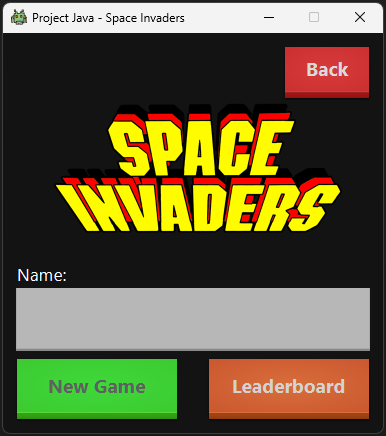
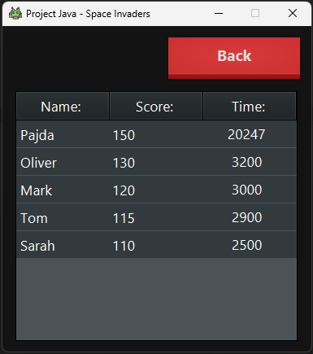
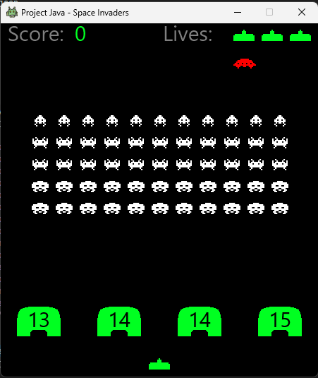

# Project for Java I & II (Clone of Space Invaders)

## Project Theme
The project will be an copy of retro game called Space Invaders [URL](https://cs.wikipedia.org/wiki/Space_Invaders)
Project aims to implement all necessary points given my teacher.

## Points to implement

### Java I 
* When coding, adhere to the conventions for writing in the Java language (revised version - https://www.scribd.com/doc/15884743/Java-Coding-Style-by-Achut-Reddy), and you can use the settings of the provided workspace (workspace-template.zip), which has automatic formatting enabled.
* Static methods and variables should NOT be used except for helper functions and constants - their use should be consulted with the instructor.
* The project will include the use of interfaces, collections, and working with I/O streams.
* Objects will be worked with via the most general type/interface, not a specific class.
* A mandatory part of the project evaluation will be its defense, during which you will be able to explain the fundamental aspects of the project to the instructor.
* Complete the project within the scope and quality commensurate with your abilities - functionality is more important than 100% perfection and adherence to the original.

### Java II
* Modify the project from the subject "Programming in Java 1" or create a new one in such a way that the application:
  * has a client-server architecture, combined with a REST architecture;
  * contains persistent data stored using JPA;
  * creates logs to both a file and the console, using log4j2;
  * addresses the issue of concurrency using CompletableFuture;
  * supports multilingualism;
  * uses Lombok;
  * works with date and time or with money;
  * uses streams and lambda expressions;
  * can be built using the Maven tool and the resulting build creates an executable jar or its equivalent.

## Requirements:
- Java17+
- Maven

## Images

